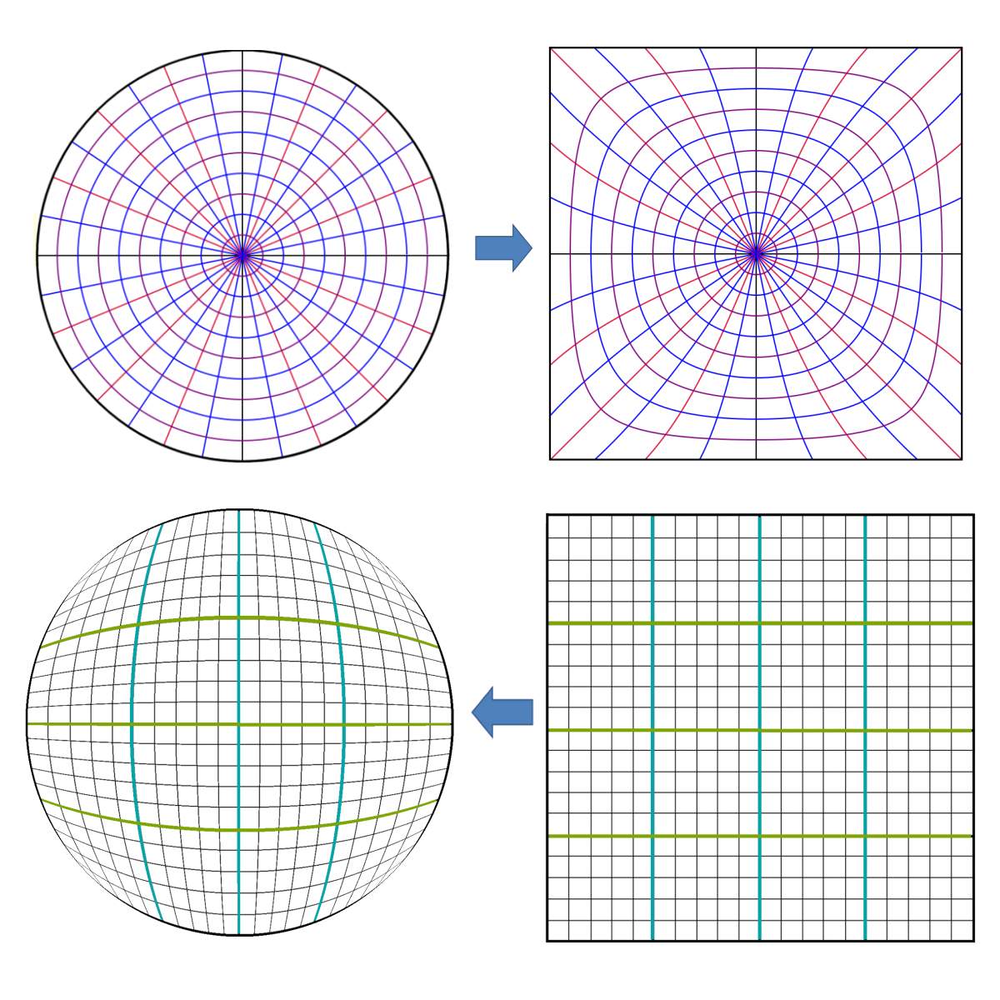
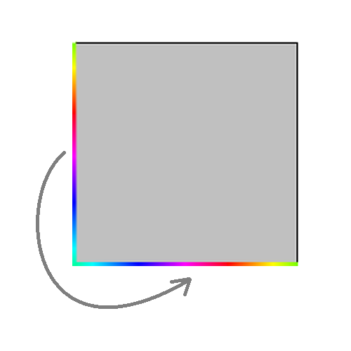
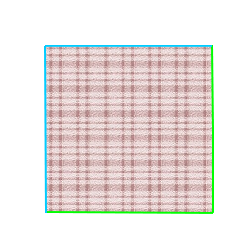
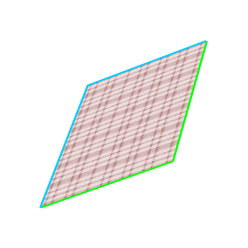
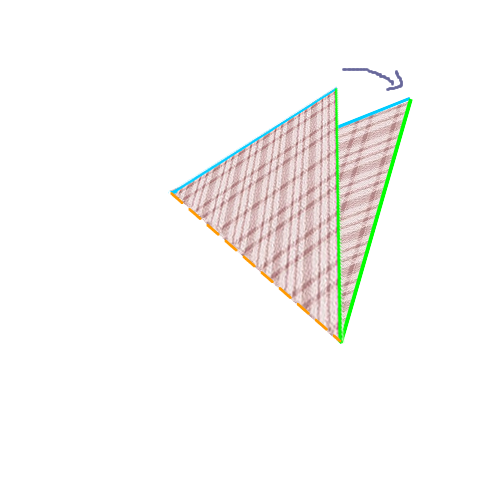
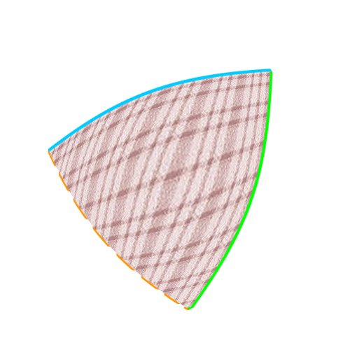

Si vous avez eu le courage de jouer assez longtemps, vous avez pu voir qu’il y a plusieurs niveaux dans ce jeu (sinon, courage: il suffit d’avoir 10 points cumulés pour passer au niveau suivant)

Et dès le premier nouveau niveau, vous avez surement vu des choses étranges se passer: le *snake* peut traverser les murs ! Et quand on commence à coller les côtés entre eux, un carré peut devenir beaucoup plus intéréssant.

### Vous avez dit topologie ?

La [topologie](https://fr.wikipedia.org/wiki/Topologie), c’est le domaine des maths qui s’intéresse à la structure, à la forme des objets.

Par exemple, on peut se dire qu’entre une boule de pétanque et une boule de bowling, il n’y a pas grande différence, si on se dit que la taille n’est pas importante. Mais finalement, entre un ballon de basket et un ballon de rugby non plus: même si ils n’ont pas exactement la même géométrie, ils ont une forme similaire: il suffit d’applatir le ballon de basket pour avoir un ballon de rugby.

> On dit que le ballon de basket est **homéomorphe** au ballon de rugby

Mais en topologie, on va beaucoup plus loin: par exemple, un carré est homéomorphe à un disque 😵

Imaginez une toile élastique incassable, qu’on peut seulement étirer et déformer à l’infini. On va mettre des couleurs sur cette toile pour voir ce qui se passe.

Voilà comment on peut passer du disque au carré.

On voit bien qu’entre les deux images, on a "cassé aucune ligne"

> En topologie, deux espaces sont homéomorphes si on peut passer de l’un à l’autre de façon continue, sans déchirure ni recollement.

Donc, et utilisant le même principe, on peut dire qu’une tasse et une bouée, c’est à peu près la même chose:

Et pareil entre une vache et une sphère:

**Et quel rapport avec notre jeu ?**

C’est très simple: Les mathématiciens adorent classer des trucs, et les spécialistes de la topologie ont essayé de découvrir tous les espaces topologiques possibles en 2 dimensions. Et bonne nouvelle, on peut tous les créer en collant les bords d’un carré !!!

Alors prenons un carré très élastique, de la colle mathématique et c’est parti 😉

#### 1) le ruban

On va commencer simple, en collant les deux côtés d’un carré entre eux.

En fait, cette idée existe dans plusieurs jeux d’arcade, comme par exemple:

Vous pouvez le faire sur une vraie feuille de papier et du ruban adhesif. Vous obtenez un cylindre, qu’on appelle d’avantage un ruban en topologie.

#### 2) le tore
Si vous regardez le ruban qu’on vient de créer, on a encore un problème: il y a un bord.

Mais on peut encore procéder à un collage, et raccorder le bord du haut et celui du bas. Vous devinez quelle forme on obtient ?
N’oubliez pas, vous avez le droit d’étirer la surface autant que vous voulez !

**Solution:** 

On obtient une bouée. En mathématiques, cette forme s’appelle un tore

#### 3) la sphère

Là, on commence les choses sérieuses.

Quand on a fait le premier collage de notre carré, on a choisi les deux côtés opposés. Mais on aurait pu faire autrement.

Un autre moyen de faire est de coller les côtés adjacents entre eux:

Si vous essayez avec un carré de papier, vous obtenez un cone.
Et un cone, quand on l’aplatit, ça donne … Un disque. Et un disque, c’est homéomorphe à un carré ! Donc pour l’instant, ce n’est pas très intéréssant.

Mais maintenant, on va coller les deux autres côtés ensembles.
Cette fois, ce qui se passe est plus difficile à imaginer

- **0.** On part d’un carré élastique.

- **1.** on va déformer ce carré en l’étirant aux 2 coins opposés

- **2.** On colle les côtés verts entre eux, et les côtés bleus entre eux

- **3.** on obtient deux triangles collés entre eux sur les bords. Pensez à un chausson au pomme ou à une calzone, par exemple.

- **4.** Il ne reste plus qu’à mettre notre chausson au four. Si il gonfle assez, il deviendra une sphère !

Si vous avez suivi toutes les étapes, vous avez vu que j’ai beaucoup transformé mon carré, mais je n’ai fait aucun collage ou découpage à part coller les 4 côtés. Donc pour la topologie, pas de problème.

 

#### 4) le ruban de moebius

Revenons à notre ruban.
Si on essaie de le décrire, on s’aperçoit qu’il a:
- 2 faces
- 2 bords, 1 en haut et 1 en bas

Et si je vous disais qu’il était possible de faire avec du papier un objet avec *un seul bord* et *une seule face* … Essayez d’imaginer à quoi un tel objet pourrait ressembler.

Si vous n’y arrivez pas, prenez un papier, des ciseaux et de la colle.

- Découpez une bande de papier de quelques centimètres de large.

- Collez les deux extrémités de la bande entre eux, mais **en faisant un demi tour avant**

Ce que vous obtenez s’appelle un ruban de moebius. 

Vous pouvez essayer de le colorier, en prenant une couleur par face.
Vous pouvez aussi essayer de le découper dans le sens de la largeur.

Et pour un topologiste, c’est une façon tout à fait normale de recoller les bords d’un carré !

 

#### 5) la bouteille de klein

Je vous laisse celui là en exercice:

Essayez de coller les bords de ce carré de cette façon:

 
 

Normalement, vous tombez sur cet objet: La bouteille de Klein

#### 6) le plan projectif réel

Si il vous reste encore des neurones, aller voir cette vidéo pour voir ce qui se passe quand on relie les côtés d’un carré deux à deux opposés, en leur faisant faire chacun un demi tour.

    

## Pour aller plus loin

La topologie est un domaine des maths très vaste, et je n’ai fait qu’éfleurer les concepts qui existent. On a fait la liste de toutes les variétés en 2 dimensions, mais on peut faire la même chose avec la 3D et toutes les autres dimensions, et on a même pas parlé de connexité. 

Si vous voulez creuser un peu plus, vous pouvez aller voir cette vidéo:

